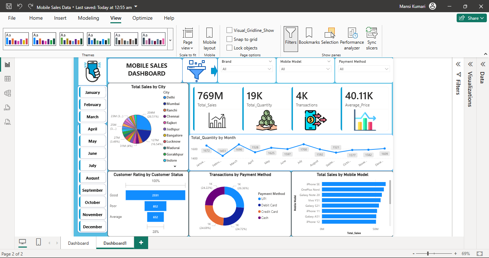
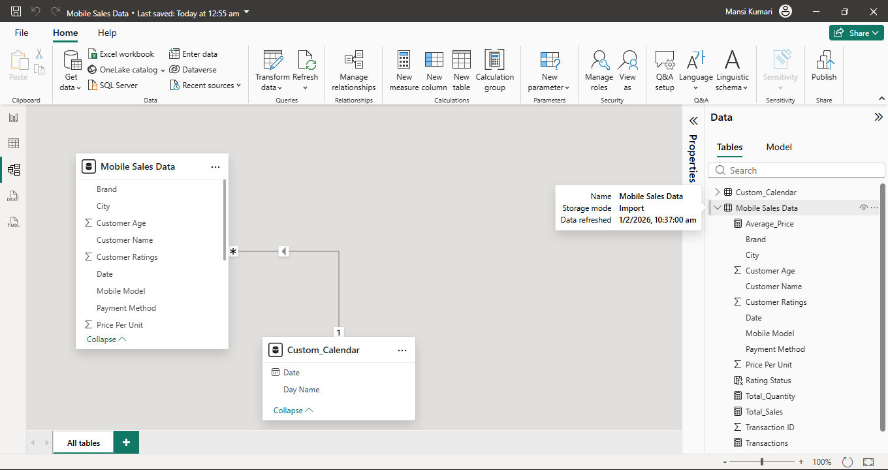
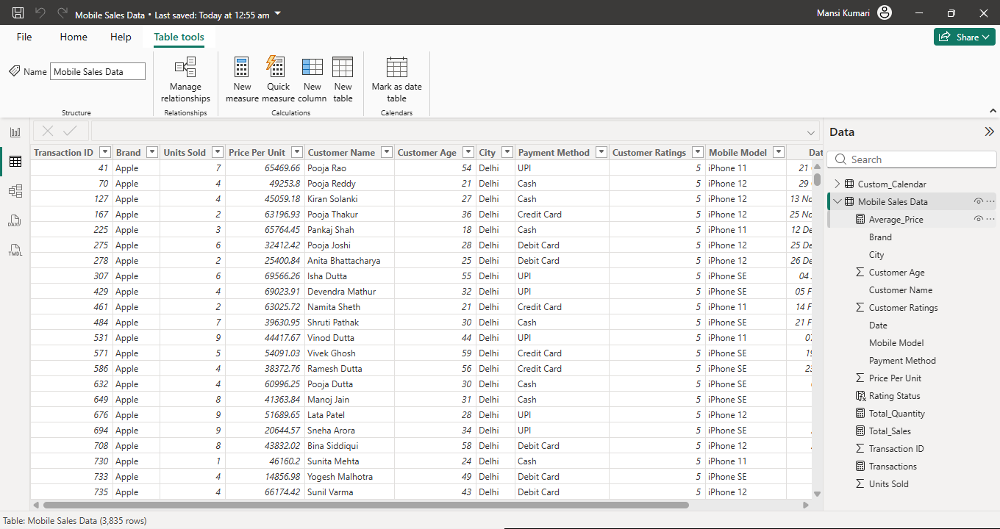

Interactive Power BI dashboard analyzing mobile sales data

Mobile Sales Dashboard – Power BI Project

🔹 Project Overview
This project is an interactive Power BI dashboard built to analyze mobile phone sales data across multiple dimensions such as city, brand, mobile model, payment method, time, and customer ratings.
The dashboard provides actionable insights into sales performance, customer behavior, and transaction trends.

🔹 Key Learnings & Skills Applied
✔ Understanding and cleaning raw sales data
✔ Creating a Custom Calendar Table
✔ Building relationships in the data model
✔ Writing DAX calculations for KPIs
✔ Designing an interactive and visually appealing dashboard
✔ Implementing filters, slicers, and drill-down interactions

🔹 Dashboard Features
📌 Total Sales, Total Quantity, Transactions, Average Price KPIs
📌 City-wise sales distribution (Pie Chart)
📌 Monthly sales trend analysis
📌 Transactions by payment method
📌 Sales by mobile model
📌 Customer rating analysis
📌 Interactive slicers for:
Brand
Mobile Model
Payment Method
Month

🔹 DAX Measures Used
Total_Sales = SUMX('Mobile Sales Data',
'Mobile Sales Data'[Units Sold] * 'Mobile Sales Data'[Price Per Unit])

Total_Quantity = SUM('Mobile Sales Data'[Units Sold])

Transactions = DISTINCTCOUNT('Mobile Sales Data'[Transaction ID])

Average_Price = AVERAGE('Mobile Sales Data'[Price Per Unit])

🔹 Data Model
Fact Table: Mobile Sales Data
Dimension Table: Custom Calendar
One-to-many relationship created using Date field

🔹 Tools & Technologies
Power BI Desktop
DAX
Data Modeling
Excel / CSV Dataset

## 📸 Project Screenshots

### 📊 Dashboard Overview

### 🧩 Data Model

### 📋 Table View

